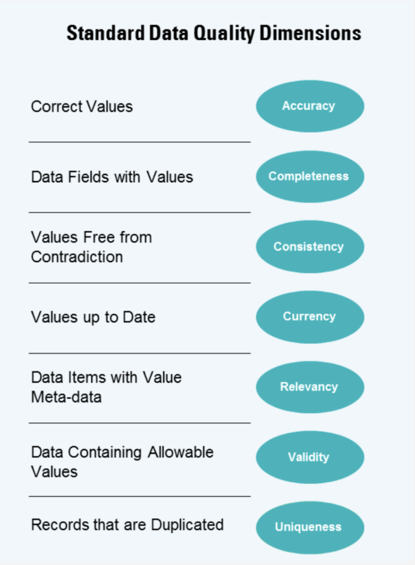

# KPMG Internship: Data Quality Assessment and Customer Targeting

## Overview

This project focuses on assessing the data quality of three datasets provided by Sprocket Central Pty Ltd: Customer Demographic, Customer Addresses, and Transactions data from the past 3 months. We will also identify potential high-value customers and provide recommendations for the marketing team to target.

## Repository Contents
Under the submission folder: 
- `communicating_data_quality.pdf`:  Jupyter notebook for the data quality assessment
- `presentation.pptx`: PowerPoint presentation outlining our approach and findings
- `dashboard.twb`: Tableau dashboard summarizing the analysis

## Phases

1. **Data Exploration**: Understand data distributions, identify potential data quality issues, and explore trends.
2. **Model Development**: Perform feature engineering, data transformations, and build a model for customer targeting.
3. **Interpretation**: Interpret results, develop marketing and growth strategies, and identify additional datasets for insights.

### Phase 1: Data Exploration
This is found in python in the *data_quality* notebook, 
- Examine dataset statistics, distributions, and missing values
- Identify inconsistencies, inaccuracies, and anomalies
- Visualize key features and trends
- Produce a report: communicating_data_quality.pdf

### Phase 2: Model Development
This is found in python in the *data_analysis* notebook, 
- Feature engineering: create new features and aggregate data
- Data transformations: normalize and scale data for modeling
- Calculating metrics such as customer lifetime value, loyalty and churn
- Apply machine learning algorithms for customer segmentation and targeting
- Evaluate model (RFM - Recency, Frequency, Monetary) performance and refine as necessary

### Phase 3: Interpretation
This is found in the presentation and Tableau Dashboard
- Analyze customer segments and their value
- Propose marketing and growth strategies based on trends and segments
- Identify additional external datasets to enhance customer insights

## Deliverables

- A PowerPoint presentation detailing our approach and findings for each of the 3 phases
- A Tableau dashboard displaying data summary and analysis results (max. 3 views/tabs)

## Insights

- Trends in the underlying data
- High-value customer segments
- Marketing and growth strategies for Sprocket Central Pty Ltd
- Potential additional datasets for better insights into customer preferences

## Tableau Dashboard

Access the Tableau dashboard [here](https://public.tableau.com/app/profile/nour5844).

## Dependencies

You can install these dependencies using pip: `pip install pandas scipy statsmodels numpy seaborn matplotlib scikit-learn pingouin`
